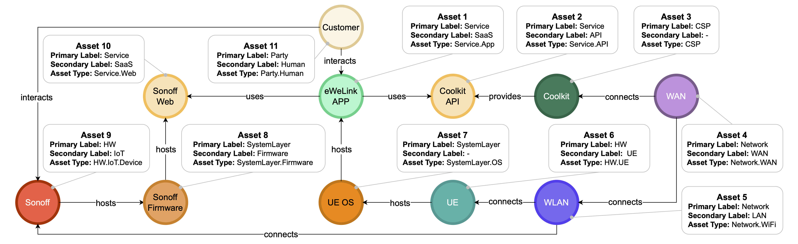
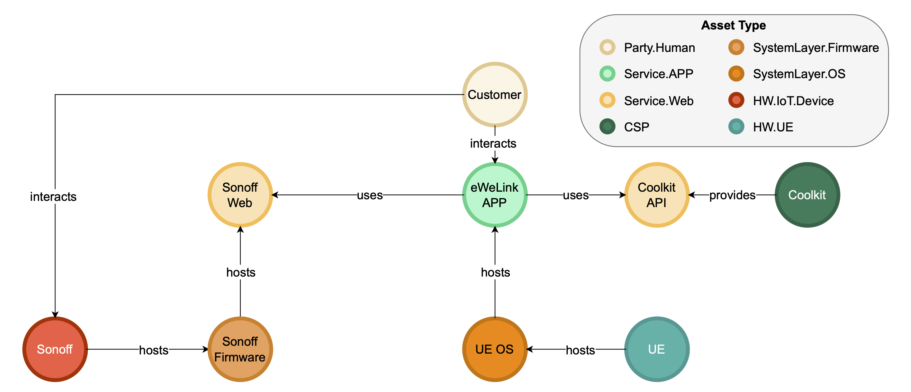

# Model Processing and Evaluation

The formalization of the MACM model as a property graph enables us to adopt [Neo4j](https://neo4j.com), a graph database that fully implements the characteristics of a Property Graph as a basis for both storing, automatically verify correctness of the models and update the models, granting their syntactic and semantic coherence.

## Storing and manipulating a MACM

Neo4j uses Cypher as its query language, a declarative query language that allows for creating and manipulating graphs.
For example, considering the MACM shown below and stored in Neo4j, if we wanted to obtain the name, labels, and type of the node hosted by the node `Sonoff Firmware`, we could use the following query:



```cypher
match (ns:SystemLayer {name:"Sonoff Firmware"}) -[:hosts]->(nt)
return nt.name, labels(nt), nt.type
```

Note that `ns` and `nt` are *variables* in Cypher, while `labels()` is a built-in function that returns the labels; in our case, the Primary and Secondary Label.
If, instead, we wanted to know on which network the service `Sonoff Web` is exposed, we could use the following query:

```cypher
match (network:Network)-[]->(:HW)-[:hosts*1..]->(sonoff_web:Service {name:"Sonoff Web"})
return network.name, labels(network), network.type
```

This query contains a complex pattern: we are considering the case in which there is a node of type `Network` connected to a node of type `HW`, which in turn is connected by one or more `hosts` edges to the target node `Sonoff Web`.

## Verification of MACM correctness

To check the consistency of a system model with the MACM schema, we represent each constraint as a Cypher query that detects violations directly on the graph. When a constraint is respect the result is a void, while when constrints are not respected, the queries return the subgraphs that outline the error, helping the modeler to correct the MACM accordingly.

Each Cypher query implementing a constraint is implemented as a **trigger** that runs automatically whenever a graph is created or updated. This ensures that violations are detected immediately and the system model remains consistent throughout its lifecycle. Since the validation is cyclic, whenever new nodes or relationships are added, the resulting MACM must still satisfy all rules. The overall verification algorithm is equivalent to the logical **AND** of all individual rules: the model is valid if and only if all constraints return no violations.

### Example of a Constraint Trigger

One of the constraints states that any $\mathtt{uses}$ relationship between two nodes must be supported by an alternative communication path that does not itself rely on $\mathtt{uses}/\mathtt{interacts}$ edges.  
This ensures that a declared dependency is feasible at the architectural level, for example through a network connection.
A simplified trigger for verifying this constraint might be written using [APOC](https://neo4j.com/docs/apoc/2025.07/background-operations/triggers/) Neo4j library. We developed a trigger called `check_uses_path` that calculates the number of violations using the following query:

```cypher
MATCH (a)-[:uses]->(b)
    WHERE NOT EXISTS { MATCH p = (a)-[*1..]-(b)
    WHERE ALL(rel IN relationships(p) WHERE NOT type(rel) IN ["uses", "interacts"])
```

The query is executed whenever a MACM is created or modified, and it raises an alert if the number of detected violations (e.g. query results) is greater than zero.

Consider two services, `eWeLink_APP` and `Sonoff_Web`, hosted on two different hardware nodes, `UE` and `Sonoff`, respectively.  
If `eWeLink_APP` has a $\mathtt{uses}$ relationship to `Sonoff_Web` but there is no network (no $\mathtt{connects}$ path) linking `UE` and `Sonoff`, the communication is physically impossible and the constraint is violated.
In our scenario, we modified the MACM presented above, as shown in the figure below.



As in evidence, this MACM isolates the exact nodes and relationships from your MACM and intentionally omits any $\mathtt{connects}$ (or other non-$\mathtt{uses}$) path between `UE` and `Sonoff`, thus reproducing a concrete violation of the constraint.

The implementation of APOC Neo4j triggers additionally provides safeguards against incorrect MACM modifications, such as the addition of invalid components or relationships. This capability proves essential for the cyclical penetration testing methodology outlined above.
The complete list of triggers is available [here]().
Note that the verification that the edges belong to the list $\mathtt{uses}, \mathtt{interacts}, \mathtt{provides}, \mathtt{connects}, \mathtt{hosts}$ is implicitly handled in the implementation of the rule described in Relationship Pattern Validity table, which represents a more stringent requirement by not only restricting the edges to that list but also enforcing constraints on the primary labels of both the source and target nodes.
Note also that the triggers are employed not only to enforce semantic constraints, but also to handle structural constraints, thereby ensuring a consistent implementation.