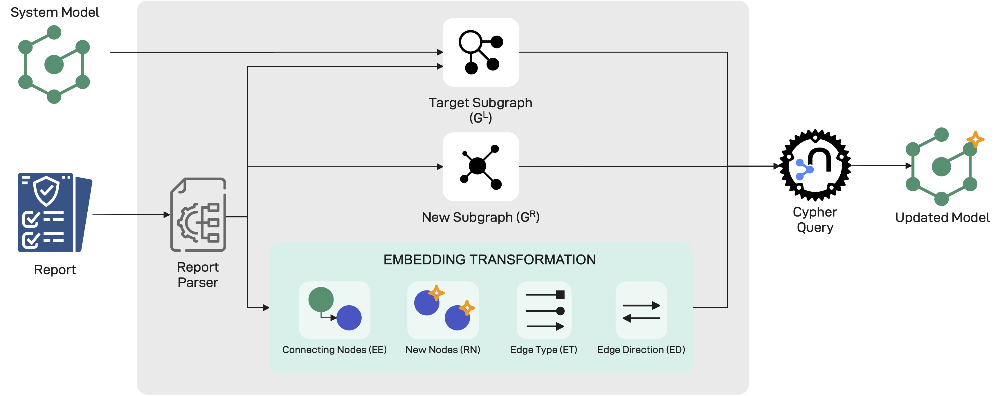

# Citation

> 📢 Please use the following citation when referring to MACM:
> ```bibtex
> @article{moretta_correct_2026,
>   title = {Correct by design, complete by iteration: {A} graph-based framework for automated security assessment},
>   volume = {36},
>   issn = {2542-6605},
>   url = {https://www.sciencedirect.com/science/article/pii/S2542660525003658},
>   doi = {https://doi.org/10.1016/j.iot.2025.101851},
>   journal = {Internet of Things},
>   author = {Moretta, Felice and Barbato, Umberto and Rak, Massimiliano and Granata, Daniele},
>   year = {2026},
>   keywords = {Security, Security Assessment, Threat Modeling, CAPEC, Internet of Things, Penetration Testing, IoT, System Modeling},
>   pages = {101851},
> }
> ```

# Automatic Model Update

The MACM supports automated updating, i.e. given an initial system model it is possible to apply a transformation able to enrich the model with new information and/or take into account changes in the system (as an example a change in deployment).
Given that the system model is represented as a Property Graph, graph-grammar theory, and, in particular, *production rules* for graph modification can be applied to formalize this process.
As an example, if during a penetration test happens the discovery of new assets, the transformation will implement a procedure that, starting from the data retrieved during the penetration test (e.g. using the attack tool), is able (i) to identify the nodes and edges that need to be incorporated into the model and (ii) to determine their correct placement and integration.

A *production* is formally defined as a triple $\Pi = \langle G^{L}, G^{R}, \mathcal{I} \rangle$, where $G^{L}$ denotes the subgraph of G to be replaced, $G^{R}$ is the subgraph to be added to G, and $\mathcal{I}$ represents the embedding transformations, i.e., the rules that determine how $G^{R}$ must be connected to G among the infinitely many possible alternatives. More specifically, an embedding transformation is a set of quadruples $\mathcal{I} = \{(EE, RN, ET, ED)\}$, referred to as embedding transformation fragments. Here, EE is the expression identifying the nodes of $G^{L}$ that must be connected to the new nodes in $G^{R}$; RN specifies the nodes of $G^{R}$ to be connected to those indicated in EE; ET defines the types of edges to be used for connecting nodes in EE to those in RN; and finally, $ED \in \{0,1\}$ indicates the edge direction, where $ED=1$ denotes an edge from EE to RN, and $ED=0$ denotes the opposite.
The flowchart of the process is shown in the figure below.



The choice of which production to apply in each case depends on the tool used to perform the attack. Accordingly, each entry in the Tool Catalogue is associated with a dedicated parser that implements a corresponding production. It is important to emphasize that productions are designed to always yield a graph that is valid with respect to the formalization introduced in the Model Definition. Nevertheless, inconsistencies may still arise, so validation triggers are automatically executed to detect and handle such inconsistencies whenever they occur.
It is worth noting that, different production rules will be needed, depending on the type of changes that data discovery or deployment changes implies.